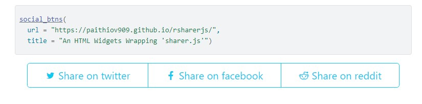

# rsharerjs

<!-- badges: start -->
<!-- badges: end -->

> Create social share buttons for R Markdown or Shiny.

This package provides a function `social_btns()` to display a simple set of social share buttons
for R Markdown or Shiny apps.

This widget includes [ellisonleao/sharer.js](https://github.com/ellisonleao/sharer.js).
Displaying the widgets requires fontawesome and bootstrap.

## License

MIT license.
